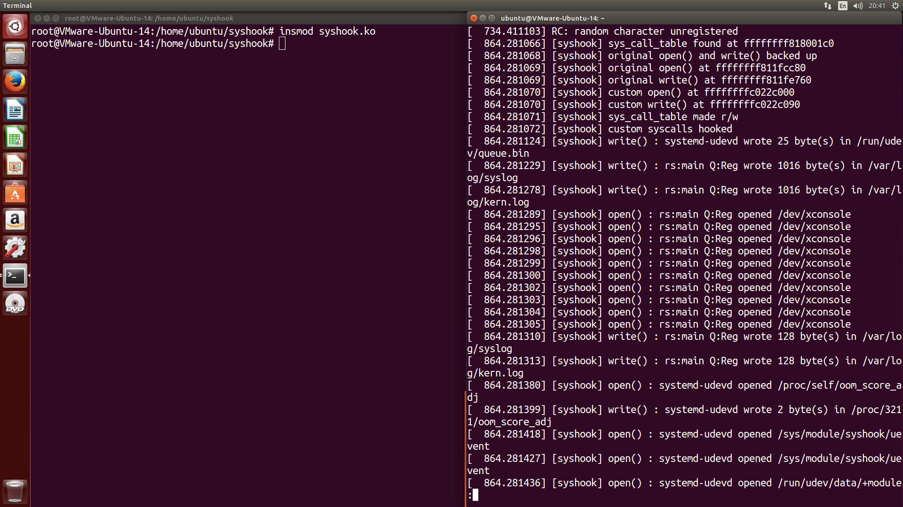

# Tìm hiểu về Linux kernel

## Thông tin đồ án

- Đồ án thứ 2 cho môn Hệ Điều Hành (CSC10007-18CLC3), FIT @ HCMUS
- Nhóm gồm 3 thành viên

  - `18127231`: Đoàn Đình Toàn, [@t3bol90](https://github.com/t3bol90)
  - `18127185`: Bùi Vũ Hiếu Phụng, [@alecmatts](https://github.com/alecmatts)
  - `18127221`: Bùi Văn Thiện, [@84436](https://github.com/84436)
- Môi trường
  - Ngôn ngữ lập trình: `C`, biên dịch với `gcc`
  - Môi trường lập trình: `Ubuntu 14.04.5 LTS` (phiên bản nhân Linux: `4.4.0-31-generic`) 
    - **Ghi chú**: Mã nguồn của các module của nhóm trong đồ án này chỉ được viết và test trên môi trường lập trình nói trên. Các Linux distro phiên bản gần đây đã chuyển qua nhân Linux `5.x` trở lên nên sẽ có một số điểm không tương thích/một số tính năng bị mất đi vì lý do bảo mật kernel.
      (VD: system call table trong `syshook` không thể đọc/ghi được theo phương pháp tìm địa chỉ của `sys_call_table` trong `System.map` — việc cố gắng đọc/ghi sẽ dẫn đến segfault và/hoặc kernel panic.)


## Tiến độ

*  Phân công:
    * Toàn: `randocha` (character device để tạo số ngẫu nhiên)
    * Thiện: `syshook` (module hook vào các system call `open()` và `write()`)
    * Phụng: viết báo cáo, sửa lỗi.
*  Tiến độ: đã hoàn thành 100%
    * `syshook`: hiện tại không thể lấy địa chỉ của `sys_call_table` linh động (cần gán cứng)


---


## Về `dmesg`

Trong quá trình nạp/gỡ module và thử nghiệm, ta cần xem các thông báo từ kernel và hệ thống (hay gọi đúng hơn là **d**iagnostic **mes**sa**g**e). Để có thể tiện xem (scroll và tìm kiếm) output của `dmesg`, ta dùng công cụ `less`.

Đối với `dmesg` phiên bản cũ (được đi kèm trong phiên bản Ubuntu nói trên), chạy:

```bash
# [F]ollow input
dmesg | less +F
```

Đối với `dmesg` phiên bản mới hơn, chạy:

```bash
# follo[-w] input (update khi có thay đổi), [-H]uman-readable output, co[-L]orize;
# output [-R]aw control chars, [F]ollow input
dmesg -H -L=always | less -R +F
```

Để xóa hết log trong `dmesg`

```bash
dmesg -C
```


## `randocha`

### Hướng dẫn nhanh

```bash
// Build module và user tool
$ make

// Nạp module
# insmod randocha.ko

// Chạy user tool để thử
# ./user_space

// Gỡ module
# rmmod randocha

// Dọn dẹp
$ make clean
```


### Thiết kế

Có 2 thành phần trong `randocha`:

- Module dùng để tạo số ngẫu nhiên và cho phép các chương trình đọc số ngẫu nhiên đó qua `/dev/randocha`
- Công cụ dùng để test: mở `/dev/randocha`, đọc và xuất số ra màn hình


### Cơ chế hoạt động

- **File operations**

  Cấu trúc `file_operations` dùng để định nghĩa các hàm driver interface theo chuẩn kernel cho trước chỉ đến địa chỉ hàm ta muốn, gồm:

  - `dev_open`: open device
      - Về cái counter `open_cnt` xuất hiện trong `dmesg`: Các tiến trình khác nhau gọi module này một cách riêng biệt; nếu xuất ra cùng một thông báo sẽ không thể phân biệt được tiến trình nào đã gọi thiết bị
  - `dev_read`: Khởi tạo số ngẫu nhiên và trả lại cho người dùng (ở đây là `user_space`)
      - Cơ chế sinh số ngẫu nhiên: dùng `get_random_byte()` để random từng byte một trên cả 4 byte.
      - 4 byte đó sẽ được đưa lại cho tiến trình ở user space
  - `dev_release`: Sau khi trả về số ngẫu nhiên, thông báo đóng device

- **Khi khởi tạo module**

  1.  Đăng kí major number cho device với `file_operations` được khai báo trước. Ở đây ta để major number được cấp phát động thay vì gán tĩnh
  2.  Tạo device class với tên được định nghĩa sẵn
  3.  Tạo device với các thông tin đã khởi tạo ở bước 1 và 2

  Tất cả các bước đều đã xử lí lỗi, nếu không thực hiện được sẽ đưa ra lỗi tương ứng.

- **Khi gỡ module**

    Ngược lại với quá trình khởi tạo module, quá trình hủy module được thể hiện qua sơ đồ: major device $\rightarrow$ device class $\rightarrow$ major number

    - Quy tắc: Unregister trước khi hủy, trừ những ngoại lệ sau:

      - Device: không thể unregister device
      - Major number: giải phóng major number đăng kí với device bằng hàm `unregister_chrdev`


### Ảnh chụp chạy mẫu


Hình: `randocha_module` đã được nạp thành công; công cụ test đã được gọi 4 lần.


---


## `syshook`

### Hướng dẫn nhanh

```bash
// Tìm địa chỉ sys_call_table tương ứng trên hệ thống và sửa lại source
$ grep -w sys_call_table /boot/System.map-$(uname -r) | cut -d ' ' -f 1
$ nano syshook.c

// Build module
$ make

// Nạp module
# insmod syshook.ko

// Gỡ module
# rmmod syshook

// Dọn dẹp
$ make clean
```


### Thiết kế

Phần `syshook`này chỉ bao gồm một standalone module.

Module hiện tại chưa thể tìm địa chỉ của `sys_call_table` (system call table) một cách linh động nên sẽ gán cứng. Địa chỉ này cần được sửa lại (xem **Hướng dẫn nhanh**) trước khi module được build và nạp.


### Cơ chế hoạt động

- **Khi khởi tạo module:**
  
  - Đọc `sys_call_table` và làm cho bảng đó ghi được (r/w)
  - Lưu lại con trỏ trỏ đến hàm xử lý syscall gốc cho `open()` và `write()`, sau đó thay thế với con trỏ đến hàm của module
  
- **Trong quá trình module chạy:**

    Mỗi một lần syscall `open()` hay `write()` được gọi, hàm xử lý tương ứng của module sẽ được gọi. Lúc đó, hàm sẽ ghi thông tin cần thiết ra log của kernel và truyền các tham số đầu vào về hàm xử lý syscall gốc tương ứng.

    - Đối với `open()`, `open_custom()` sẽ ghi vào log: tên tiến trình đã gọi, tên file được mở
    - Đối với `write()`, `write_custom()` sẽ ghi vào log: tên tiến trình đã gọi, tên file đang ghi và số byte đã ghi

- **Khi gỡ module:**

    - Khôi phục lại syscall gốc cho `open()` và `write()`
    - Làm cho `sys_call_table` trở thành chỉ đọc (r/o)


### Ảnh chụp chạy mẫu



Hình 1: `syshook` đã được nạp thành công; địa chỉ bảng `sys_call_table`, các hàm xử lý syscall gốc, các hàm xử lý syscall của module và thông tin mỗi hooked syscall được in ra.


Hình 2: `syshook` đã được gỡ thành công.


---


## Tài liệu tham khảo

- Tài liệu đã được cung cấp
- [GitHub repo của @khang99](https://github.com/npkhang99/CSC10007-Project2)
- [GitHub repo của @vltanh](https://github.com/vltanh/SystemCall-Hook)
- [GitHub repo của @johnthomasjtk](https://github.com/johnthomasjtk/OS-System-call-hooking)
- [Medium – Sourcerer – "Writing a Simple Linux Kernel Module"](https://blog.sourcerer.io/writing-a-simple-linux-kernel-module-d9dc3762c234)
- [The Linux Kernel Programming Guide – Chapter 2, "Hello World"](https://tldp.org/LDP/lkmpg/2.6/html/c119.html)
- [Medium – InfoSec Write-Ups – "Linux Kernel Module Rootkit — Syscall Table Hijacking"](https://medium.com/bugbountywriteup/linux-kernel-module-rootkit-syscall-table-hijacking-8f1bc0bd099c)

